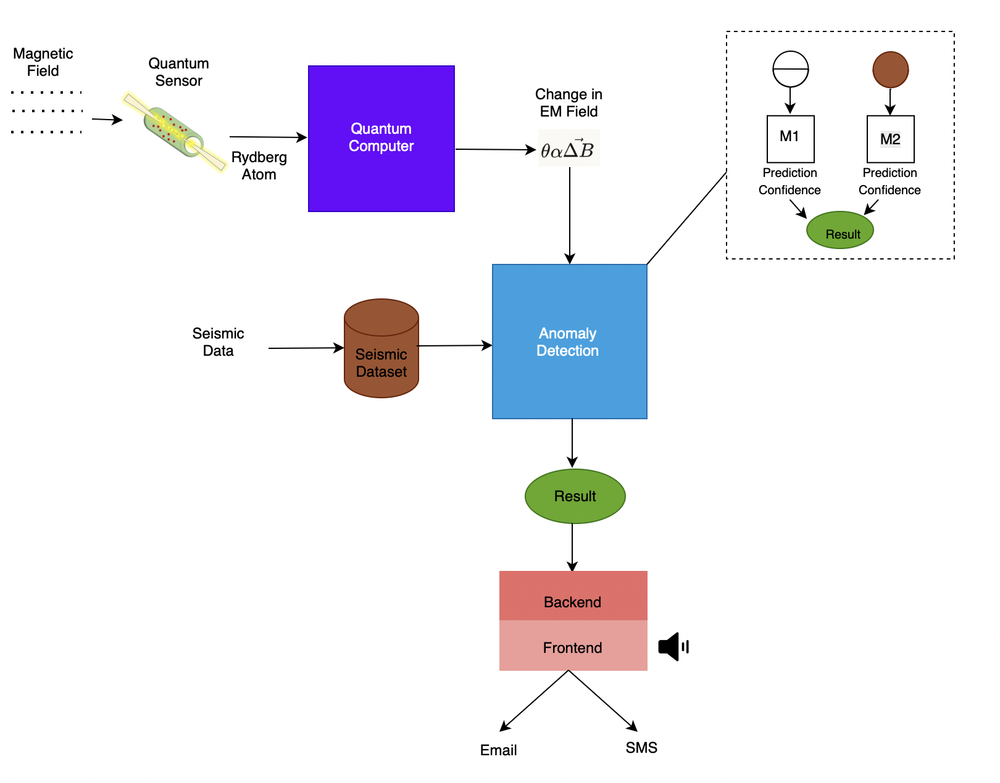

# NYUAD
# Quantum-Enhanced Seismic Prediction System

## Overview
This project proposes a hybrid seismic prediction system that integrates **quantum sensing** with **classical AI/ML models** to improve early detection of seismic activities (e.g., earthquakes).

The system fuses information from two sources:
- Quantum sensor-based electromagnetic field measurements (via a quantum sensor) fed into a Quantum Computer to get changes in EM field.
- Traditional seismic datasets (acoustic/seismic sensor data)

Predictions from both streams are then combined to produce a **final, enhanced prediction**.

---

## System Architecture

### 1. Quantum Sensor + Quantum Computer
- **Quantum Sensor:** Utilizes a Rydberg atom-based quantum sensor to measure fine changes in the electromagnetic (EM) field.
- **Quantum Computer:** Processes changes in the EM field and outputs features representing seismic activity precursors.

### 2. Classical AI/ML Models
- **Quantum Data Stream:** Quantum-computed EM features are passed into a classical AI/ML model for prediction.
- **Seismic Data Stream:** A traditional seismic dataset (acoustic data, etc.) is passed separately into another classical AI/ML model for prediction.

### 3. Prediction Combination
- Predictions from both AI/ML models are **fused** to produce a **combined final prediction**, leveraging the strengths of both data sources.

---

## Workflow Summary

1. **Quantum Sensor** detects EM field changes.
2. **Quantum Computer** processes EM data.
3. **Classical AI/ML Model (Quantum Stream)** predicts based on quantum features.
4. **Classical AI/ML Model (Seismic Stream)** predicts based on seismic data.
5. **Combined Prediction** merges outputs from both models to improve accuracy.

---

## Components

| Component | Description |
|:----------|:------------|
| Quantum Sensor | Detects subtle electromagnetic field variations using Rydberg atoms. |
| Quantum Computer | Processes sensor outputs to extract meaningful features for ML models. |
| Classical AI/ML Models | Separate models trained on quantum features and seismic datasets. |
| Seismic Dataset | Traditional time-series data of acoustic activity and time-to-failure measurements. |
| Combined Prediction | Merges predictions from both pipelines to enhance reliability. |

---

---

## Visualization

The system architecture is summarized in the diagram below:

---

